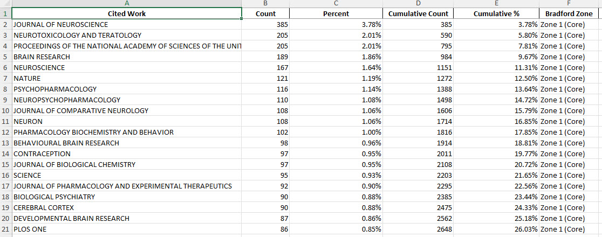
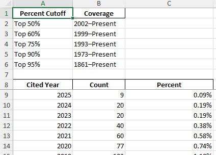
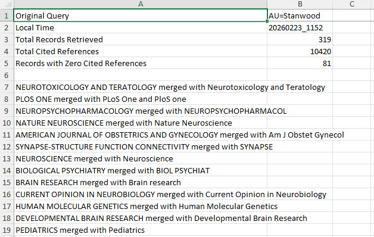

# WoS SR + Cited References Analysis

This repository exports **Web of Science (Expanded API)** *Short Records* (SR) for a query, collects the **UT/UIDs**, retrieves **cited references** for each record, writes a CSV, and (optionally) produces an Excel workbook with summary sheets.

It is intended to be used as a **script within a package/repo** (not as a standalone pip package), alongside the included “robust” API helper modules.

## What’s included

- `wose_sr_cr_analysis.py` — top-level runner that:
  - runs a WoS SR search (`optionView=SR`) to collect Source UIDs/UTs
  - calls the cited references endpoint for each UID
  - writes a CSV of Source UID → Cited Reference fields
  - optionally writes an Excel workbook with summary analysis
- `wosesrclient_robust.py` — robust SR client with retries/backoff and friendly invalid-query error
- `wosereferencesclient_robust.py` — robust cited-references client with retries/backoff
- `JCR 2025.csv` — local mapping file used by `wose_sr_cr_analysis.py` (variant → canonical) for “Cited Work” consolidation

> License: MIT (see `LICENSE`)

## Requirements

- Python 3.10+ recommended
- A valid **Clarivate Web of Science Expanded API** key

Python dependencies are listed in `requirements.txt`.

## Setup

1. Clone the repository and create a virtual environment.

2. Install dependencies:

```bash
pip install -r requirements.txt
```

3. Create a `.env` file in the repo root (or set env vars in your shell):

```bash
EXPANDED_APIKEY=YOUR_WOS_EXPANDED_API_KEY
```

## Running the script

You can run the script in two ways:

### Option 1 — Edit the query directly in the script

Update the `usrQuery` value in the `params` section near the top of `wose_sr_cr_analysis.py`.

Example:

```python
params = {
    'databaseId': 'WOS',
    'usrQuery': '**AU=Stanwood**',
    'firstRecord': 1,
    'count': 50,
    'optionView': 'SR'
}
```
Then run
```bash
python wose_sr_cr_analysis.py
```
### Option 2 - Use the CLI
You can override the query at runtime using the -q flag:
```bash
python wose_sr_cr_analysis.py -q "AU=Stanwood"
```
CLI arguments override the default params values defined in the script.

### Options

- `--include-zero-ref-uids`  
  Appends one blank row per Source UID that had **zero** cited references to the output CSV (default: off).

- `--no-excel`  
  Skips Excel output (default: Excel workbook is created).

Example:

```bash
python wose_sr_cr_analysis.py -q "TS=CRISPR" --include-zero-ref-uids --no-excel
```

### Parameters section (in-script defaults)

At the top of `wose_sr_cr_analysis.py` you can also set defaults without CLI flags:

- `INCLUDE_ZERO_REF_UIDS = False`
- `MAKE_EXCEL = True`

CLI flags override these defaults.

## Outputs

### CSV

A CSV is written to the working directory, named like:

- `WOS_CitedRefs_<query>_<timestamp>.csv`

Columns:

- Source UID
- Cited Reference UID
- Cited Author
- Year
- Volume
- Page
- Cited Work
- Cited Title
- DOI

### Excel (optional)

If enabled (default), an Excel file is written:

- `CR_Pivot_Analysis_<timestamp>.xlsx`

Sheets include:

- `Cited Work analysis` (counts, percent, Bradford zones)
- `Cited Year analysis` (counts, percent, plus “Top X%” coverage summary)
- `Raw Data`
- `Search Summary`

## Example Excel Output

### Cited Work Analysis


### Cited Year Analysis


### Search Summary


## JCR mapping file (`JCR 2025.csv`)

`wose_sr_cr_analysis.py` will attempt to load a file named **`JCR 2025.csv`** from the same folder as the script. It expects two columns:

- Column A: variant name
- Column B: canonical name

This mapping is used to merge “Cited Work” variants into canonical titles for analysis. If the file is missing, the script runs normally (no merges).

## Notes and limitations

- WoS API limits apply (rate limits, max 100,000 results per query, etc.).
- The SR client surfaces invalid field-tag searches as a friendly `InvalidWoSQueryError`.
- For very large queries, consider tightening the query or slicing by year/other fields.

## MIT License

This project is released under the MIT License.
